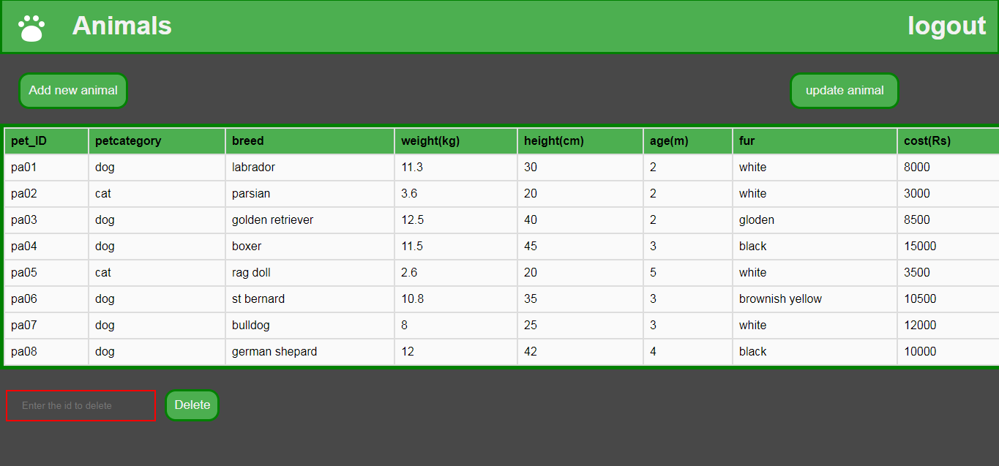

# **PawSential Hub** :dog: :cat: 
A lightweight database management system designed for small-scale pet shop owners to efficiently track available pets, manage product inventory, and monitor sales activity in real-time.

# Objectives :muscle:
* To develop a web-based interface tailored for pet shop owners, enabling efficient management of all shop-related activities.

* To offer a comprehensive solution for storing and managing essential information about pets and pet products within the shop.

* To facilitate the recording and management of the shop's sales transactions, ensuring accurate and streamlined sales tracking.

* To provide a structured system for maintaining detailed customer profiles, including contact information and purchase history.

* To monitor and track the sales of pets and products, linking each transaction to the respective customer for effective post-sale service and support.

# Developed with 

 **HTML**  **CSS**   **PHP**   **MYSQL**

## Screenshots :wink:
* Login page

   

* Home page
  
  

* Animals page
   
   

* Birds page

  

* Pet Products page

  

* Sales details page 

  

* Customer page

  

* Add new Animal
  
  

   
# PawSential-Hub
